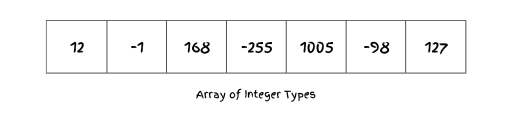

# Arrays

The array data structure is one of the most commonly used data structures. Arrays are simple in design but highly reliable in practice, and are used in a wide variety of situations over any other data structure. However, they are not without their problems, which can sometimes adversely affect the system's performance. 

## What is an Array:
An array is a collection of elements that are all of the same data type and are stored in contiguous locations within memory. An array provides random access to elements through the use of an index, which is used to locate elements in an array.

### Where arrays are used?
Arrays are used in a wide variety of applications. It would take a long time to list all of them; I have just chosen a few to illustrate my point.
* **Storing and accessing sequential data:** An array can be used to store and access sequential data elements, such as movie or product ratings, stock prices, and employee records, etc.,
* **Sorting and Searching Algorithms:** The use of arrays is common in algorithms that involve sorting and searching information. In addition, the fact that they are indexed makes it possible to implement classic algorithms efficiently.
* **String Manipulation:** Strings are often represented as arrays of characters in programming languages. As a result, individual characters can be manipulated, accessed, and processed efficiently.
* **Lookup Tables and Caching:** For fast lookups, arrays are used, where the index corresponds to the key. Hash maps and caches are common examples of lookup tables that are implemented using arrays. 
* **Graphs and Trees (Adjacency Matrices):** Arrays can be used to represent graphs and tree structures, particularly for compact representations of connections between nodes.
* **Handling Multidimensional Data:** Arrays (often referred to as tensors or multidimensional arrays) are used to represent data with more than two dimensions in domains such as machine learning and scientific computing.